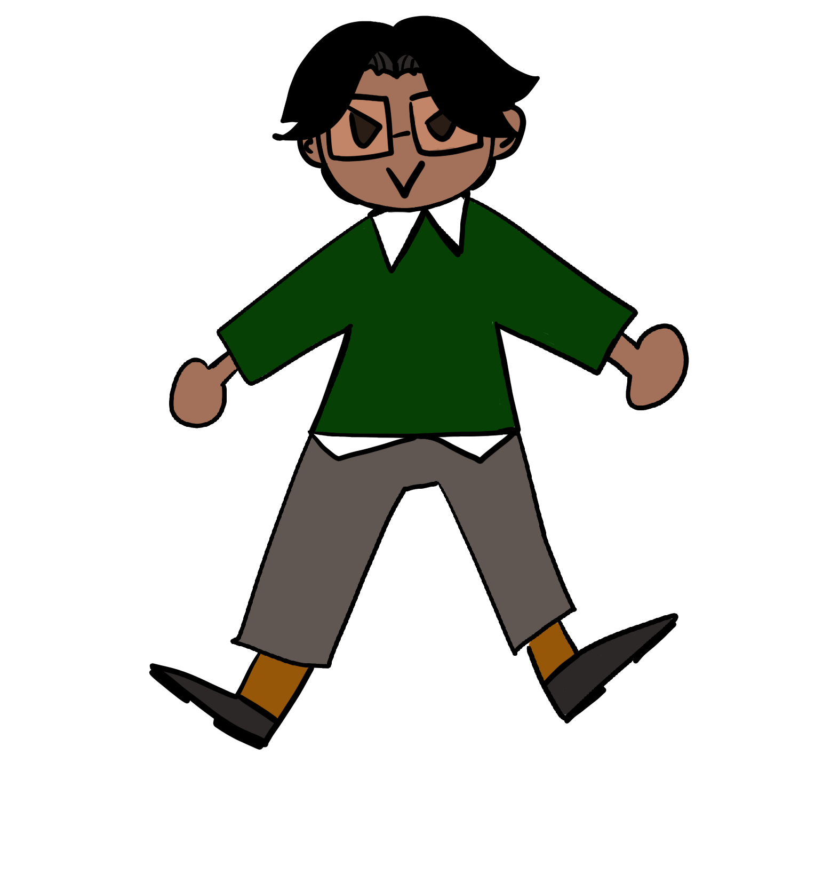

<!-- # Hello there!  -->
# turbo-ismam 
Evil Ismam

## 💫 About me
- 🧔🏻‍♂️ Pronouns: he/him.
- 📝 Languages: ~~Scala/Java~~ Italian/English.
- 📚 Career: Master's degree in Computer Science and Engineering "Alma Mater Studiorum - Università di Bologna".
- 🔥 Interests: tech enthusiast & love designing and developing new ideas that are highly usable, useful, elegant and extensible.
- 🐱 & 🍫 Addict.

### ✨ Slogans
> Programs must be written for people to read, and only incidentally for machines to execute. *- Abelson and Sussman*

> If we wish to count lines of code, we should not regard them as ‘lines produced’ but as ‘lines spent. *- Edsger Dijkstra*

### 🔗 How to reach me

## ⚡ Technologies

### Paradigms:
- **Functional:** Take control of your code, make it reusable and remove boilerplate
- **Object Oriented:** Appreciate more higher level like Java, Scala & C#
- **Concurrent:** Actors and Agents base languages/frameworks (Akka)

### Machine Learning & IoT
- **Python:** Pandas, Numpy, Matplotlib
- **Frameworks:** OpenCV, PyTorch, Keras
- **MQTT:** fantastic protocol used in some of my domotic projects
- **Devices:** sensors, actuators, data cleaning

### Distribuited Systems
- **General:** I’m fascinated by the theory behind distributed computing, especially by the theory behind algorithms to mitigate the CAP theorem
- **Apache technologies:** like BookKeeper, ZooKeeper and Pulsar.
- **Algorithm:** like Raft, Consensus, Leader election, Mutual esclusion, Replication

### Known languages

### Known Frameworks

## 💻 My GitHub Stats 

  

  

  

  

